## SDR-PICO V1 and V2

[A project from Burkhard Kainka, DK7JD ](https://www.elektronik-labor.de/Raspberry/Pico38.html)

The Raspberry Pi Pico can generate an HF (high-frequency) signal on its GPIO pins thanks to its dedicated GPIO assembly language, known as PIO (Programmable I/O).


## SDR-PICO V1
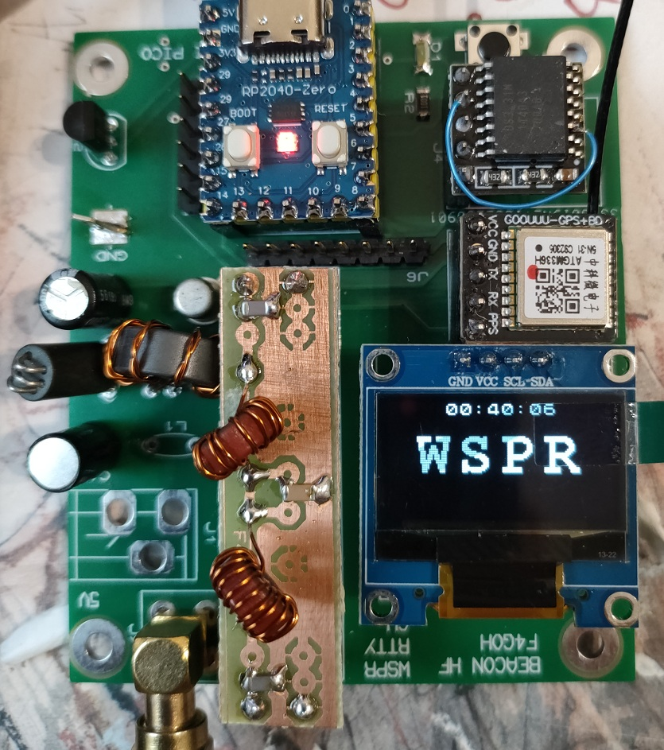

# 📡 Beacon Specifications

## 🧩 Hardware

- **Microcontroller:** Raspberry Pi Pico (RP2040)
- **Power supply:** USB or external +5V source
- **GPS module**
- **Optional RTC:** DS3231 real-time clock
- **Amplifier:** 2N2222 (0.1 W max)
- **Removable filter**
- **PCB:** Available in Gerber format

## 💻 Software Compatibility

- Arduino IDE 1.8+
- PlatformIO (OSX / Windows / Linux)

## 📶 Transmission Modes

- WSPR
- FT8
- Hell
- RTTY
- CW

## Schematics

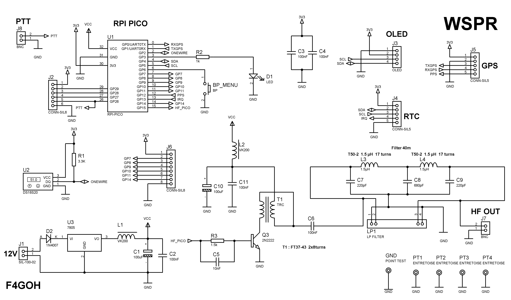

## PCB
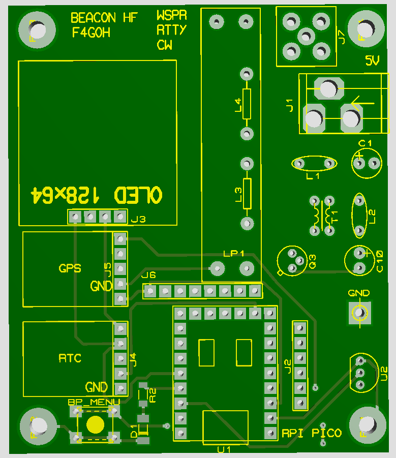

## RPI PICO ZERO PINOUT

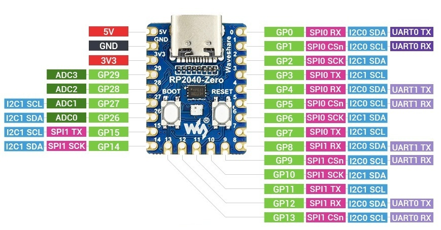

## Testing SDR-PICO V1 board

### With solar pannel no batteries 20m band

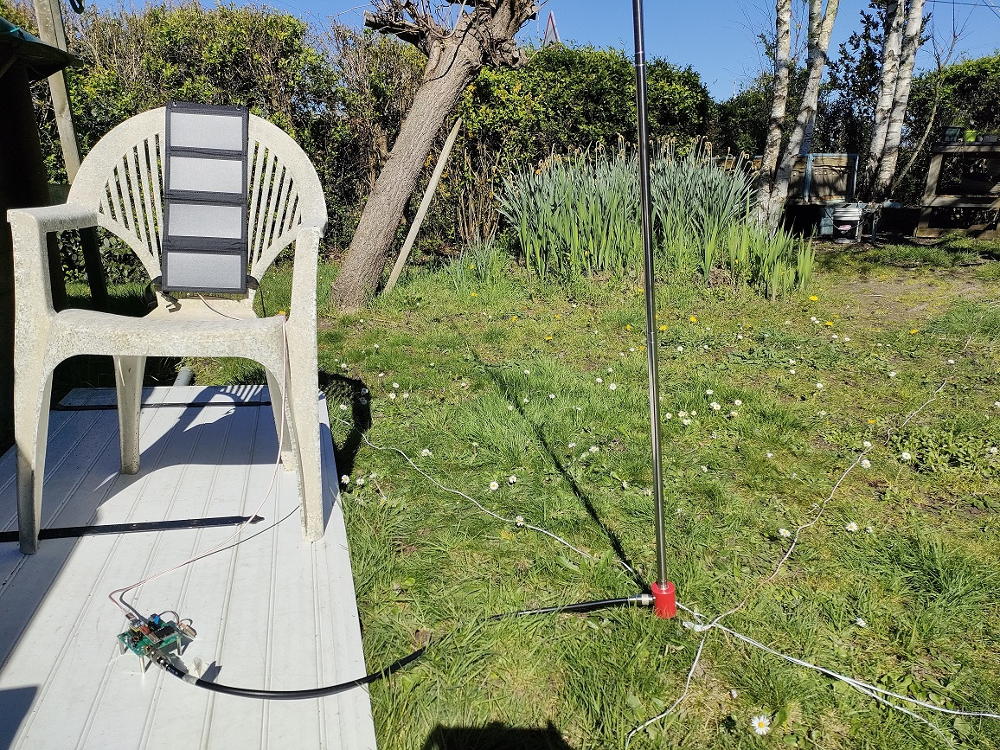

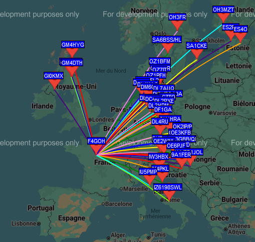

### 20m band during one night


### 40m band

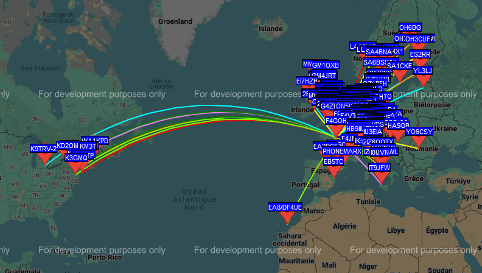

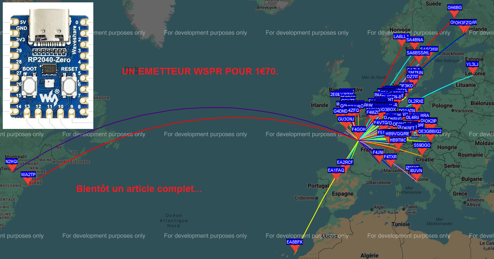

## Raspberry Pi Pico RP2040 Specifications

### Core Features
- **Microcontroller**: RP2040, designed by Raspberry Pi
- **Processor**: Dual-core ARM Cortex-M0+ running at up to 133 MHz
- **Memory**: 264 KB of SRAM and 2 MB of on-board QSPI Flash storage
- **USB**: USB 1.1 with device and host support

### GPIO and Connectivity
- **GPIO Pins**: 26 multi-function GPIO pins, including:
  - 2 × SPI, 2 × I2C, 2 × UART, 3 × 12-bit ADC, and 16 × PWM channels
- **Programmable I/O (PIO)**: 2 PIO blocks, each with 4 state machines for custom peripheral support
- **Debugging**: SWD debug pins available

### Power and Input
- **Operating Voltage**: 3.3V (régulator via micro-USB or external power source)
- **Low Power Consumption**: Power-efficient design with various sleep and dormant modes

### Software and Compatibility
- **Supported Languages**: C/C++ and MicroPython
- **Development Environment**: Official support for the Raspberry Pi Pico SDK, including integration with the Visual Studio Code (VS Code) IDE
- **Alternative IDE**: Arduino IDE support via the Arduino-Pico core

## Configuration

```console
>help
Available commands
Set transmission frequency                  : freq 7040100
Set offset value                            : offset -200
Set callsign                                : call F4XYZ
Set locator                                 : loc JN07
Set mode  wspr rtty ft8 hell cw             : mode wspr
Set modulo in minutes                       : minute 10
Set number of repeated frames to send       : nbframe 2
Set cw words per minute                     : wpm 15
Set transmission power (dBm)                : dbm 10
Set email address                           : mail f4xyz at example.com
Set gps baud rate                           : gpsbaud 9600
Scan I2C bus                                : scan
Show nmea frame                             : nmea 1
Save current configuration to EEPROM        : save
Display current configuration               : show
Reset all parameters to default values      : raz
Restart RPI pico                            : restart
Show this help message                      : help
Exit menu                                   : exit>
```
The minimum setup for a quick WSPR test is:

```console

raz             Initialize parameters
freq 7040100    Set transmission frequency
call F4XYZ      Enter callsign
loc JN07        Enter locator
mode wspr       Select transmission mode
minute 2        Transmit every two minutes
dbm 10          Set power level information for WSPR
save            Save configuration
show            Display configuration

>show
Current configuration :
  freq           : 7040100 Hz
  offset         : -200
  call           : F4GOH
  locator        : JN07
  dbm            : 10 dBm
  mode           : WSPR
  wpm            : 12
  mail           : none@example.com
  minute         : 2 min
  nbframe        : 1
  Gps baud rate  : 9600
  Nmea debug  is : OFF
```

#### Using Arduino IDE with Raspberry Pi Pico

It is also possible to program the Raspberry Pi Pico using the Arduino IDE thanks to the Arduino-Pico core.

**Installation steps:**

1. Open the Arduino IDE
2. Go to **File > Preferences**
3. In the field **"Additional Boards Manager URLs"**, add the following URL:

   ```console
   https://github.com/earlephilhower/arduino-pico/releases/download/global/package_rp2040_index.json
   ```
4. Go to Tools > Board > Boards Manager
5. Search for "rp2040"
6. Install "Raspberry Pi Pico/RP2040" by Earle Philhower
7. Select your board via Tools > Board > Raspberry Pi Pico
   
---

# SDR-PICO V2

## Schematics

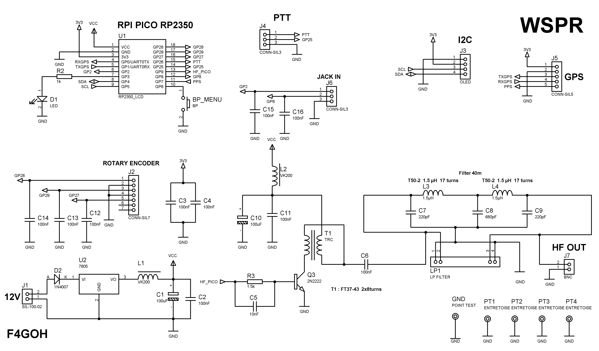

## PCB
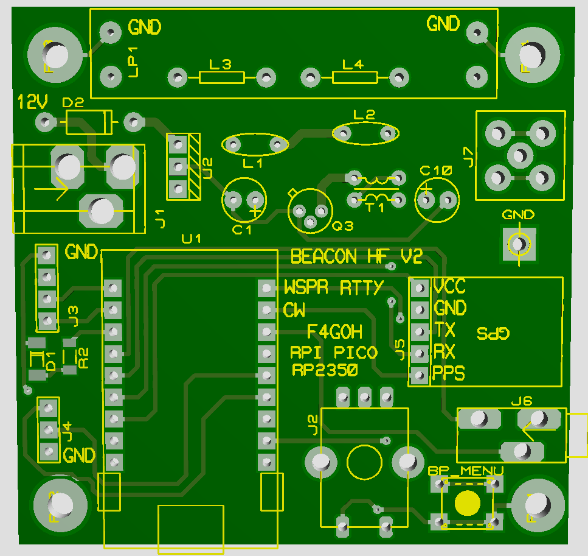

## RPI PICO ZERO PINOUT

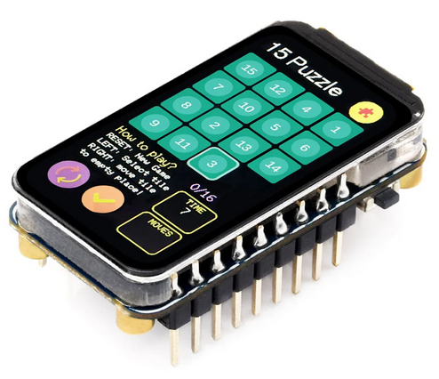

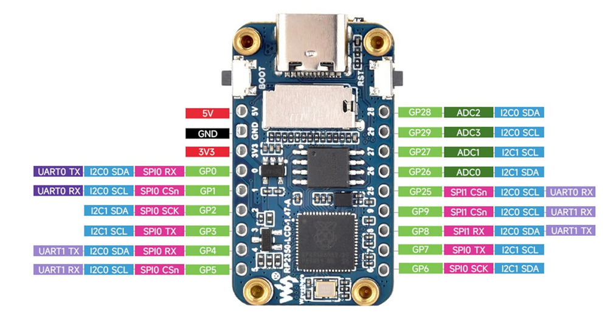


## Raspberry Pi Pico RP2350 Specifications

### Core Features
- **Microcontroller**: RP2350, designed by Raspberry Pi
- **Processor**: Dual-core ARM Cortex-M33 running at up to 150 MHz (with optional RISC-V core depending on variant)
- **Memory**: Up to 520 KB of SRAM and external QSPI Flash support (typically 2 MB or more depending on board)
- **Security**: Arm TrustZone support and enhanced security features
- **USB**: USB 1.1 with device and host support

### GPIO and Connectivity
- **GPIO Pins**: Up to 30 multi-function GPIO pins, including:
  - SPI, I2C, UART, ADC, PWM (enhanced capabilities compared to RP2040)
- **Programmable I/O (PIO)**: 3 PIO blocks with multiple state machines for advanced custom peripherals
- **Analog**: Improved ADC performance
- **Debugging**: SWD debug interface available

## testing  SDR-PICO V2 board

Soon

## Usefull links for wspr reports

- [WSPRnet (site officiel)](https://wsprnet.org/drupal/wsprnet/map)
- [WSPR Live Map](https://www.wsprnet.org/drupal/wsprnet/map)
- [WSPR Database Query](https://wsprnet.org/drupal/wsprnet/spots)
- [PSKreporter (inclut WSPR et autres modes)](https://pskreporter.info/pskmap.html)
- [WSPR Rocks](https://wsprocks.com/)
- [QRP Labs WSPR viewer](https://www.qrp-labs.com/ultimate3/wsprview.html)


